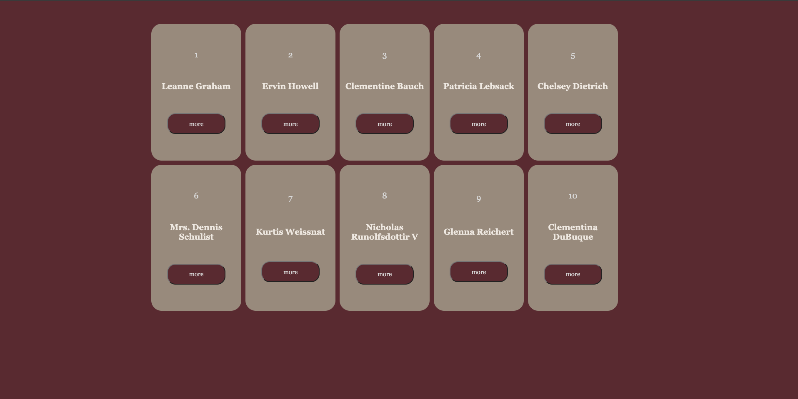
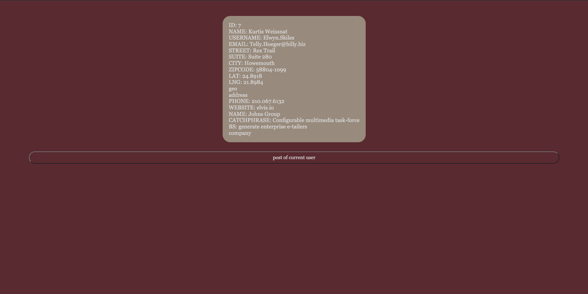
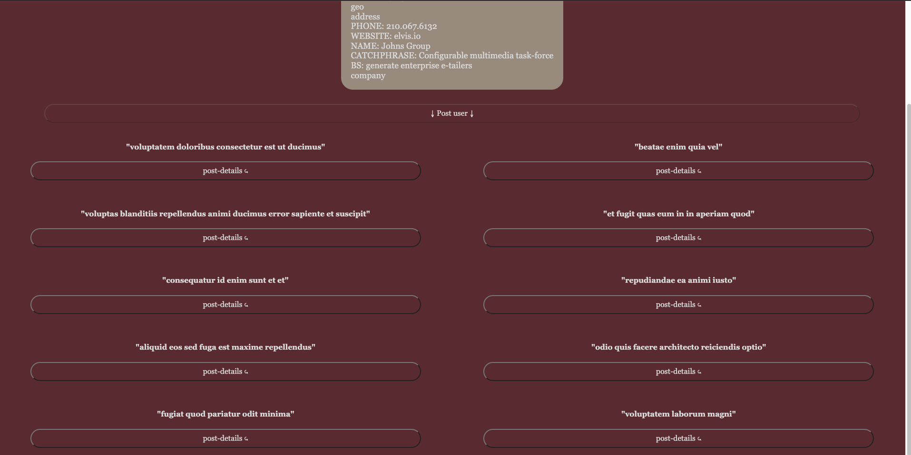
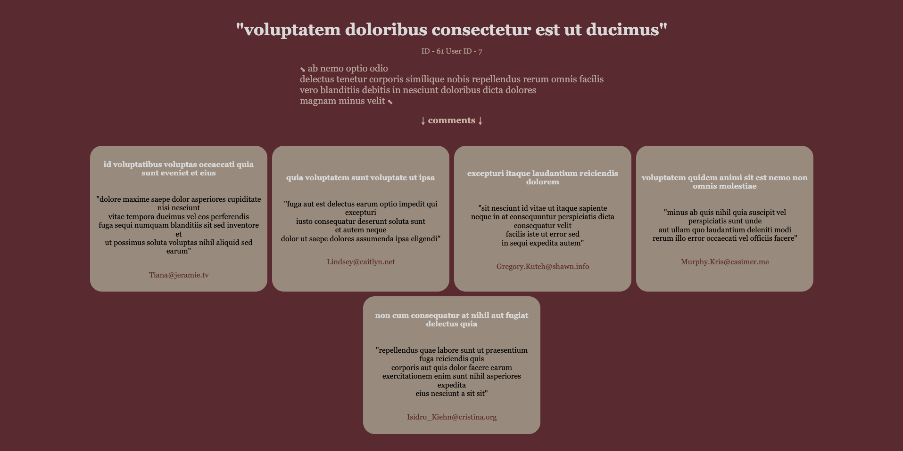

# Mini JavaScript Project: User, Comments, and Posts Management 

This mini project is a simple web page that demonstrates the basic concepts of managing users, comments, and posts. It uses HTML, CSS, and JavaScript for display.

Created on the fly in the evening to grasp the material.

